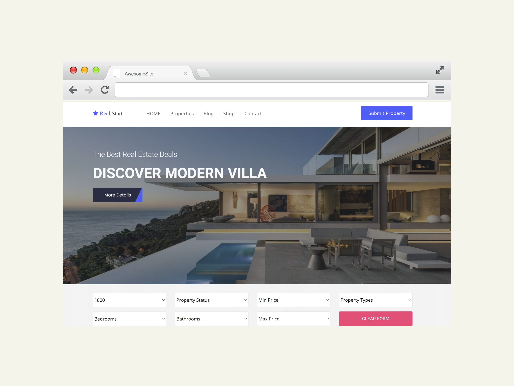

<h1>Responsive Landing page search properties</h1>
<h2>What does contains?</h2>

This is search filtering Properties for rent or buy, I am focusing in the Filtering section using a Fake DB and Valilla JS

And I implementing a nice animation using Wow and lotties

<h2>What I used for this?</h2>

I used for this landing page ***CSS**, ***VANILLA JS**, **Lotties, **WOW, and **Bootstrap>

Any question let me know!

